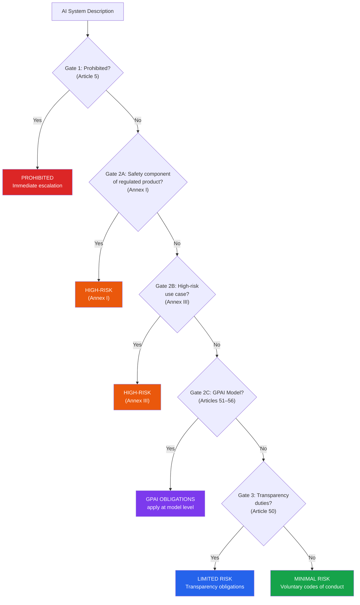
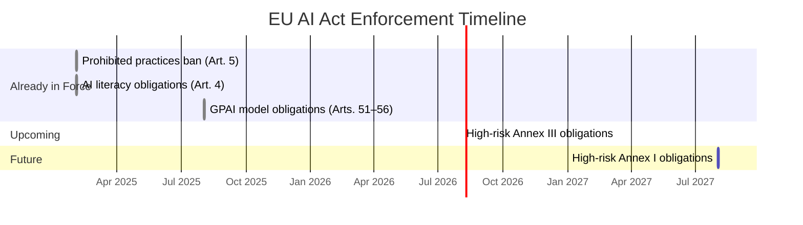

# EU AI Governance Plugin for Claude Cowork

**The missing governance layer for European AI compliance.**

Anthropic's legal plugin handles generic contract review and NDA triage. This plugin handles what it doesn't: EU AI Act risk classification, AI-specific DPIAs, vendor assessments against deployer obligations, and compliance documentation that auditors actually accept.

Built for in-house legal, compliance, and AI governance teams at European enterprises. Works standalone or alongside Anthropic's legal plugin.

## Why this exists

The EU AI Act is live. Prohibited practices are already banned. GPAI transparency obligations are in effect. High-risk AI system obligations kick in August 2026.

Anthropic's legal plugin covers GDPR basics and general compliance checklists. It says nothing about:
- AI Act risk classification (is your system high-risk?)
- Provider vs. deployer obligations (what's YOUR responsibility?)
- Fundamental rights impact assessments
- AI inventory and documentation requirements
- Works council considerations for AI systems (mandatory in DACH)
- Schrems II transfer impact assessments for AI model providers

This plugin fills that gap.

## How It Classifies AI Risk

The plugin uses a multi-gate decision framework aligned to the EU AI Act:

## Compliance Timeline

Key enforcement deadlines — the plugin tracks where you stand against each:

## Commands

| Command | What it does |
|---------|-------------|
| `/classify-ai-risk` | Determine if an AI system is high-risk under the EU AI Act. Step-by-step classification with regulatory citations. |
| `/assess-ai-vendor` | Review an AI vendor/provider contract against AI Act deployer obligations, GDPR requirements, and enterprise governance standards. |
| `/run-dpia` | Conduct a Data Protection Impact Assessment specifically designed for AI systems. Covers both GDPR Art. 35 and AI Act requirements. |
| `/ai-act-status` | Assess your organization's compliance posture against EU AI Act deadlines. Gap analysis with prioritized action items. |
| `/generate-evidence-pack` | Compile governance documentation for auditors, regulators, or internal review. Structured output ready for regulatory inspection. |
| `/review-ai-policy` | Review or draft an AI governance policy against EU AI Act requirements and industry best practices. |

## Skills

| Skill | When it activates |
|-------|-------------------|
| AI Act Classification | Determining risk levels, prohibited practices, GPAI obligations |
| AI Vendor Assessment | Evaluating AI provider contracts and compliance posture |
| DPIA for AI Systems | Impact assessments combining GDPR and AI Act requirements |
| Governance Documentation | Creating audit trails, evidence packs, compliance records |
| EU Compliance (Extended) | GDPR, AI Act, works council, and cross-border transfer requirements |
| Risk Management | AI-specific risk assessment frameworks and controls |

## What makes this different from the generic legal plugin

| Anthropic Legal Plugin | EU AI Governance Plugin |
|----------------------|------------------------|
| GDPR/CCPA checklists | Full EU AI Act classification engine with regulatory citations |
| Generic contract review | AI vendor-specific assessment against deployer obligations |
| No AI Act awareness | Deadline-aware compliance (Feb 25, Aug 25, Aug 26, Aug 27) |
| US-centric defaults | DACH-first with German templates and works council integration |
| No audit trail guidance | Evidence pack generation for regulatory inspection |
| Manual playbook configuration | Pre-built EU governance playbooks, ready out of the box |
| No risk classification | Structured risk classification per Annex III |

## Quick Start

1. Install the plugin in Claude Cowork
2. Run `/ai-act-status` to see where your organization stands
3. Use `/classify-ai-risk` for each AI system in your inventory
4. Run `/assess-ai-vendor` on your AI provider contracts
5. Generate evidence packs with `/generate-evidence-pack`

No configuration required for EU AI Act workflows. The plugin ships with built-in regulatory knowledge current as of February 2026.

## Language Support

- **English**: Full support for all commands and outputs
- **German (Deutsch)**: Templates, governance documents, and compliance reports available in German. Use `--lang de` with any command.

## Requirements

- Claude Cowork or Claude Code
- No external dependencies, no API keys, no infrastructure
- Works offline with local files

## Regulatory Coverage

- **EU AI Act** (Regulation 2024/1689): Full classification, obligations, and timeline
- **GDPR**: Extended DPA review with AI-specific considerations
- **German Works Constitution Act (BetrVG)**: Works council consultation requirements for AI systems
- **Schrems II / EU-US DPF**: Transfer impact assessments for AI model providers
- **ISO 42001**: AI management system alignment (optional)

## Worked Examples

See what the plugin actually produces — realistic, redacted sample outputs:

| Example | Command | Scenario |
|---------|---------|----------|
| [HR Resume Screening AI](examples/classify-ai-risk-hr-screening.md) | `/classify-ai-risk` | Classifying an automated recruitment tool as HIGH-RISK (Annex III) with Works Council obligations |
| [ChatGPT Enterprise Deployment](examples/assess-ai-vendor-chatgpt-enterprise.md) | `/assess-ai-vendor` | Vendor assessment with RED/YELLOW flags, contract redlines, and Schrems II analysis |
| [Customer Churn Prediction](examples/run-dpia-customer-churn-prediction.md) | `/run-dpia` | Full DPIA for an ML model processing customer behavioral data |

## Roadmap

| Version | Focus | Status |
|---------|-------|--------|
| **v1.0** | EU AI Act classification, DPIAs, vendor assessments, evidence packs, policy review | Released |
| **v1.1** | ISO 42001 full alignment — control mapping and certification readiness workflows | Planned |
| **v1.2** | NIS2 integration — cybersecurity obligations for AI in critical infrastructure | Planned |
| **v1.3** | Multi-jurisdiction — French CNIL, Dutch AP, and Austrian DSB-specific guidance | Planned |
| **v2.0** | Implementing acts and harmonised standards tracking — auto-update as EU AI Office publishes guidance | Planned |

## License

Apache 2.0 — Fork it, extend it, use it commercially.

## Built by

[Lexbeam Software](https://lexbeam.com) — AI Governance and Legal Tech for European enterprises.

---

Last reviewed: February 25, 2026.

**[View Interactive Demo](demo/index.html)** | **[Changelog](CHANGELOG.md)**

*This plugin extends and complements Anthropic's [knowledge-work-plugins](https://github.com/anthropics/knowledge-work-plugins). It is not affiliated with or endorsed by Anthropic.*

